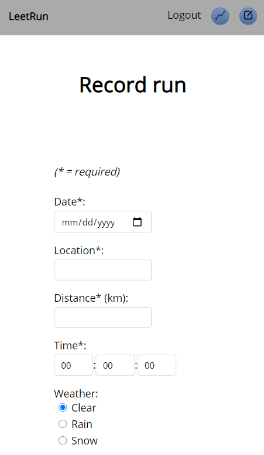
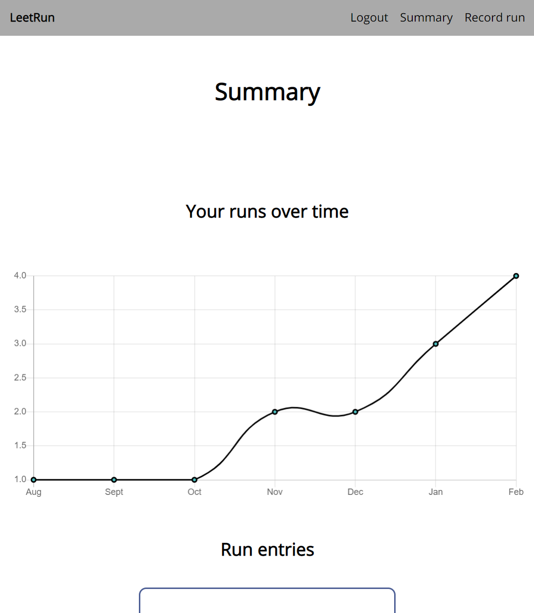
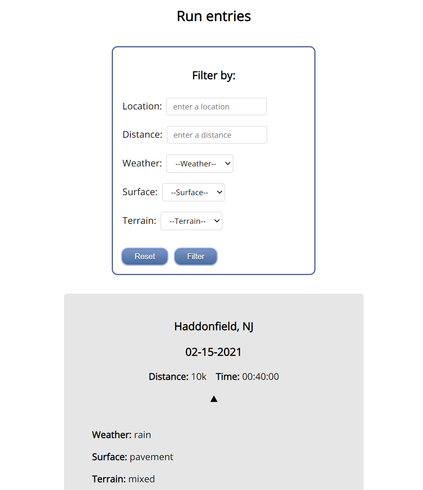

# LeetRun

## About

LeetRun is an application that allows users (runners) to record their runs and track their progress as they seek to increase their endurance, become faster, and meet their running goals.

## Live app

- [LeetRun]("http://leetrun-client.vercel.app/")

## Screenshots
 

### Landing screen
 

 

### Record your runs
 

LeetRun lets you capture all the details about your runs, including location, distance, surface type, terrain type, weather conditions, and personal notes.

 

 

### Visualize your progress
 

View a chart of how often you run over time and filter your runs based on a multitude of criteria.

 

 

### View your recorded runs
 

View your runs ordered by the latest date, or filter through them as you please.

 

## Technologies used

- HTML
- CSS
- JavaScript
- React
- React Router
- Chartjs
- Jest
- Node.js
- Express
- Knex.js
- PostgreSQL
- JWT
- Bcrypt
- Mocha
- Chai
- Sinon
- Vercel
- Heroku
- NPM
- Git
- GitHub

## How to run
- Clone the repository
- Run `npm install` in the project directory to install the dependencies
- Clone and setup [the API](https://github.com/bradrivenburgh/leetrun-api)
- Rename `example.env` to `.env` and replace the default values with your own.  These environmental variables will also need need to be configured on your deployed client (e.g., on Vercel).

## Available Scripts

In the project directory, you can run:

### `npm start`

Runs the app in the development mode.\
Open [http://localhost:3000](http://localhost:3000) to view it in the browser.

### `npm test`

Launches the test runner in the interactive watch mode.\

### `npm run build`
